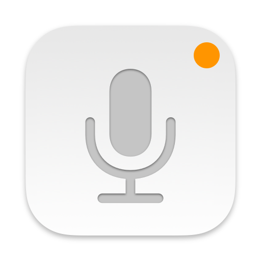
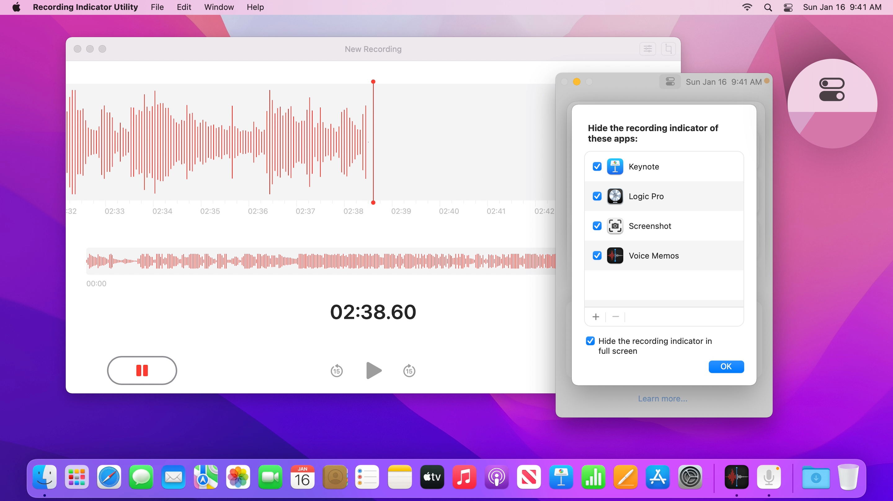
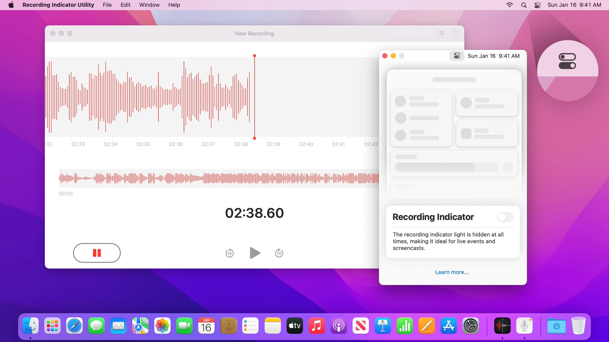
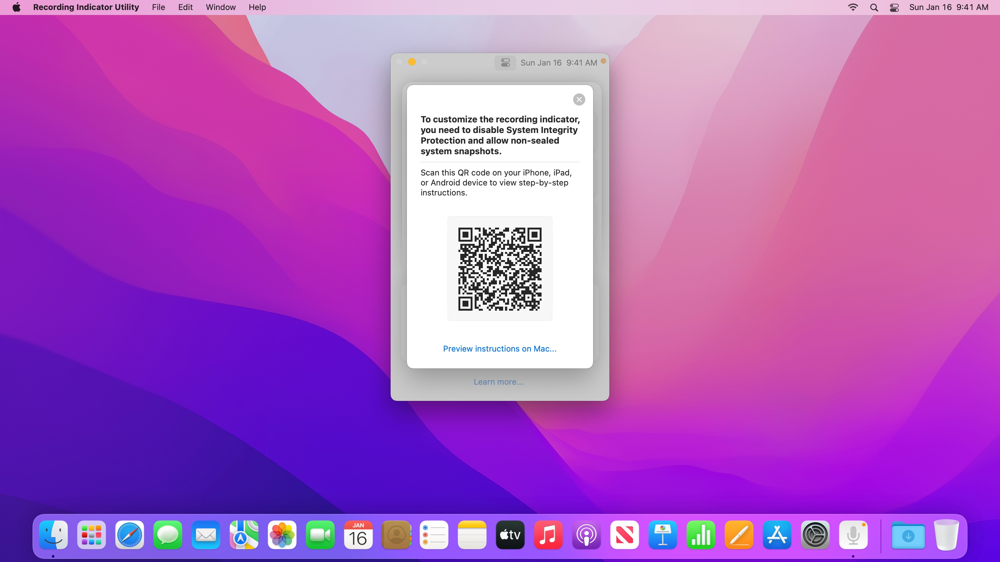

<h2>Recording Indicator Utility</h2>

Recording Indicator Utility lets you turn off the <a href="https://twitter.com/applesupport/status/1454202118336811015">orange microphone recording indicator light</a>, making it ideal for professionals who <a href="https://cdm.link/2021/12/apple-added-an-orange-dot-thats-a-showstopper-for-live-visuals-and-it-needs-a-fix/">run live events</a>, <a href="https://telestreamforum.forumbee.com/t/x2hgw5f/orange-dot-on-imac-screen-when-screenflow-is-recording">record screencasts</a>, or use a <a href="https://www.globaldelight.com/faq/boom3dmac">system-wide volume equalizer</a>.

Recording Indicator Utility supports <a href="https://support.apple.com/macos/upgrade">macOS Monterey</a>, including macOS version 12.2, 12.1, 12.0.1, and 12.0.

  

  

---

### Opening Recording Indicator Utility

After downloading Recording Indicator Utility, double click to open it. macOS may prompt you “Recording Indicator Utility cannot be opened because it is from an unidentified developer.” This is expected. 

To open Recording Indicator Utility, [right-click](https://support.apple.com/HT207700) on Recording Indicator Utility in Finder, and click “Open” as shown below.

If you right-clicked when opening Recording Indicator Utility for the first time, you may need to [right-click](https://support.apple.com/HT207700) for a second time. If Recording Indicator Utility still can’t be opened, [check your GateKeeper settings](https://support.apple.com/en-us/HT202491) under the General tab in System Preferences > Security & Privacy. Click “Open Anyway” to open Recording Indicator Utility.

Recording Indicator Utility will not harm your Mac. This alert shows up because Recording Indicator Utility modifies macOS and cannot be notarized. Recording Indicator Utility is [open source](https://github.com/cormiertyshawn895/RecordingIndicatorUtility), so you can always [examine its source code](https://github.com/cormiertyshawn895/RecordingIndicatorUtility/tree/master/RecordingIndicatorUtility) to verify its inner working.

---

### Using Recording Indicator Utility

By default, the recording indicator light shows you when an app has access to your microphone. Click the blue toggle to turn off the recording indicator light across all apps. You can also click “Per-App Settings” to see more options.

By customizing per-app settings, you can choose to hide the recording indicator of your favorite apps or in full-screen apps. Click “+” to add an app currently using your microphone, or click “Choose App…” and pick one in Finder.

When the “Recording Indicator” toggle is off, the recording indicator light is hidden at all times, making it ideal for professionals who [run live events](https://cdm.link/2021/12/apple-added-an-orange-dot-thats-a-showstopper-for-live-visuals-and-it-needs-a-fix/), [record screencasts](https://telestreamforum.forumbee.com/t/x2hgw5f/orange-dot-on-imac-screen-when-screenflow-is-recording), or use a [system-wide volume equalizer](https://www.globaldelight.com/faq/boom3dmac).

---

### Frequently Asked Questions

#### Why is Recording Indicator Utility guiding me to adjust my security settings?
To configure the recording indicator, Recording Indicator Utility needs to modify two system components, [WindowServer](https://www.quora.com/OS-X-What-is-the-WindowServer-process-and-what-does-it-mean-when-it-takes-up-high-CPU) and [Control Center](https://support.apple.com/guide/mac-help/control-center-mchl50f94f8f). Both components are protected by [System Integrity Protection](https://support.apple.com/en-us/HT204899) and [covered by the seal of the signed system volume](https://support.apple.com/guide/security/signed-system-volume-security-secd698747c9/web).

In order to modify [WindowServer](https://www.quora.com/OS-X-What-is-the-WindowServer-process-and-what-does-it-mean-when-it-takes-up-high-CPU) and [Control Center](https://support.apple.com/guide/mac-help/control-center-mchl50f94f8f), Recording Indicator Utility guides you to adjust your security settings to the appropriate level.

#### Why is Recording Indicator Utility asking me to scan a QR code to view instructions?
Adjusting your security settings requires starting up in macOS Recovery. Because Recording Indicator Utility can’t show instructions in macOS Recovery, it is easier to follow along on another device by scanning a QR code. You can also preview the instructions on your Mac.

- [Instruction for Mac computers with Apple Silicon](https://cormiertyshawn895.github.io/instruction/?arch=as-lowering)
- [Instruction for Intel-based Mac](https://cormiertyshawn895.github.io/instruction/?arch=intel-lowering)

#### Is it easier for my Mac to be attacked after adjusting security settings?
Because very few Mac users turn off System Integrity Protection or allow booting from non-sealed system snapshots, there’s little incentive or payoff for attackers to target these configurations.

#### Why is Recording Indicator Utility guiding me to turn off FileVault?
[When FileVault is on, macOS doesn’t permit booting from non-sealed system snapshots](https://support.apple.com/guide/security/signed-system-volume-security-secd698747c9/web#sec32d46902a), therefore you need to [turn off FileVault first](https://support.apple.com/HT204837#turnoff).

#### How do I raise security settings back to their defaults?
Open Recording Indicator Utility, turn on the recording indicator, then click “Raise Security Settings.” Recording Indicator Utility will [restore the last sealed system volume snapshot](https://keith.github.io/xcode-man-pages/bless.8.html#last-sealed-snapshot) and show you step-by-step instructions to raise security settings.

#### Can someone use Recording Indicator Utility to monitor me without my knowledge?
No. Your admin password is required before Recording Indicator Utility can make any changes. Recording Indicator Utility is designed to support professionals who [run live events](https://cdm.link/2021/12/apple-added-an-orange-dot-thats-a-showstopper-for-live-visuals-and-it-needs-a-fix/), [record screencasts](https://telestreamforum.forumbee.com/t/x2hgw5f/orange-dot-on-imac-screen-when-screenflow-is-recording), or use a [system-wide volume equalizer](https://www.globaldelight.com/faq/boom3dmac).

#### Why is Recording Indicator Utility asking me to access the microphone?
The microphone recording indicator only updates when you pause an existing audio recording or start a new audio recording. For changes to the recording indicator to immediately take effect, Recording Indicator Utility requests access to the microphone to make a zero (0) second long audio recording. 

The temporary recording is only used to refresh the microphone recording indicator and will be automatically discarded by macOS.

#### How does Recording Indicator Utility differ from undot and YellowDot?
Recording Indicator Utility supports [macOS Monterey](https://support.apple.com/macos/upgrade) version 12.2, 12.1, 12.0.1, and 12.0, allows you to turn off the recording indicator in any app, and requires adjusting security settings.

[undot](https://github.com/s4y/undot) and [YellowDot](https://lowtechguys.com/yellowdot/) only support macOS 12.1 and earlier, allow you to turn off the recording indicator in full-screen apps, and do not require adjusting security settings. 

#### What happens if I update macOS?
After updating macOS, changes to the microphone recording indicator will be automatically reset. You can open Recording Indicator Utility and turn it back off.

#### Can I use Recording Indicator Utility with multiple copies of macOS?
Yes. Changes you made in Recording Indicator Utility only affect the current Startup Disk. After restarting to a different Startup Disk, you can run Recording Indicator Utility again to apply changes to that Startup Disk.

Recording Indicator Utility may be unreliable if you share the same volume name across multiple volumes. To resolve this, rename these volumes so that each of them has a different name.

---

### Troubleshooting Tips

#### What if my Mac no longer starts up?
Your Mac will no longer start up if you [press Option-Command-P-R to reset NVRAM](https://support.apple.com/HT204063) or [manually raise security settings in macOS Recovery](https://support.apple.com/guide/security/startup-disk-security-policy-control-sec7d92dc49f/web) without turning on the recording indicator and clicking “Raise Security Settings” in Recording Indicator Utility first. To resolve this, start up from macOS Recovery, then turn off System Integrity Protection and allow booting from non-sealed system snapshots. 

- [Instruction for Mac computers with Apple Silicon](https://cormiertyshawn895.github.io/instruction/?arch=as-lowering)
- [Instruction for Intel-based Mac](https://cormiertyshawn895.github.io/instruction/?arch=intel-lowering)

#### Why has Apple Pay been disabled?
Apple Pay is disabled when security settings are modified. You can still authorize Apple Pay payments on the web with your iPhone. To use Apple Pay on your Mac, open Recording Indicator Utility, turn on the recording indicator, then click “Raise Security Settings” and proceed with the instructions.

#### Why am I not allowed to open iPhone and iPad apps downloaded from the App Store?
On Mac computers with Apple silicon, iPhone and iPad apps downloaded from the App Store cannot open with Permissive Security. All other Mac apps, including apps built with Mac Catalyst, are not affected. You can still install and open iPhone and iPad apps through [PlayCover](https://www.playcover.me/), [Sideloadly](https://sideloadly.io/), or [Rickpactor](https://appdb.to/app/standalone/1900000033). Only install free apps or apps you have already purchased. 

To open iPhone and iPad apps downloaded from the App Store, open Recording Indicator Utility, turn on the recording indicator, then click “Raise Security Settings” and proceed with the instructions.

#### Why does Netflix and Apple TV+ stream video in HD instead of 4K?
When System Integrity Protection is turned off, certain premium video providers such as [Netflix](https://www.netflix.com) and [Apple TV+](http://tv.apple.com) limit video quality to HD. This does not affect most video streaming websites such as [YouTube](https://youtube.com) and [Twitch](https://www.twitch.tv), nor does it affect [local video playback](https://support.apple.com/guide/quicktime-player/welcome/mac) or [editing](https://www.apple.com/final-cut-pro/).

#### Why does it take longer to download macOS updates?
After Recording Indicator Utility modifies [WindowServer](https://www.quora.com/OS-X-What-is-the-WindowServer-process-and-what-does-it-mean-when-it-takes-up-high-CPU) and [Control Center](https://support.apple.com/guide/mac-help/control-center-mchl50f94f8f), [Software Update](https://support.apple.com/guide/mac-help/change-software-update-preferences-on-mac-mchla7037245) needs to download the full macOS installer instead of a smaller update. 

If your network connection is metered, you can open Recording Indicator Utility, turn on the recording indicator, then click “Raise Security Settings” and proceed with the instructions. This will [apply the last sealed system snapshot](https://keith.github.io/xcode-man-pages/bless.8.html#last-sealed-snapshot), allowing macOS to download a smaller update.

#### What if my Mac misbehaves after raising security settings?
Before raising the security setting of your Mac, Recording Indicator Utility must apply [the last sealed system snapshot](https://keith.github.io/xcode-man-pages/bless.8.html#last-sealed-snapshot). This only affects the macOS system volume and does not affect your apps or data.

If your Mac misbehaves after Recording Indicator Utility applies [the last sealed system snapshot](https://keith.github.io/xcode-man-pages/bless.8.html#last-sealed-snapshot), choose Apple menu > Restart or force restart your Mac. Once your Mac starts up, open Recording Indicator Utility and click “Raise Security Settings” again.
