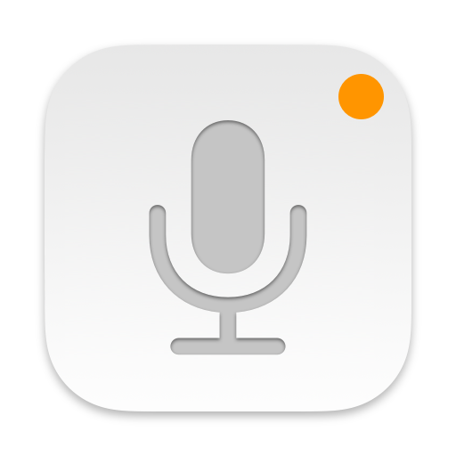
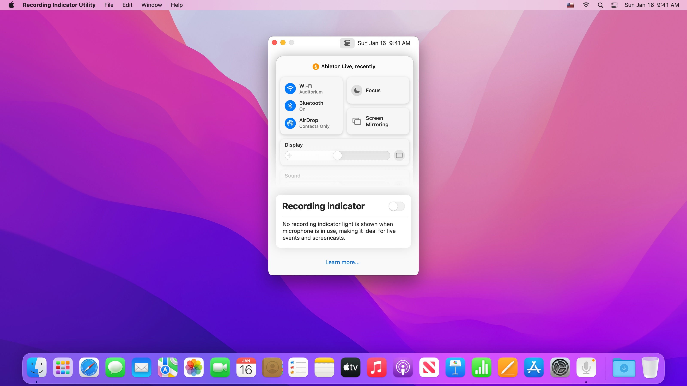
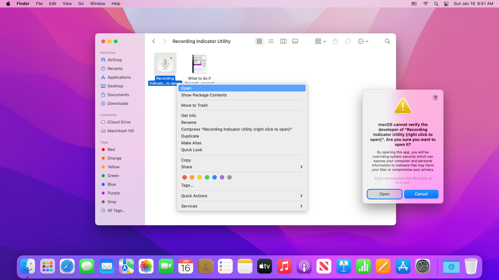
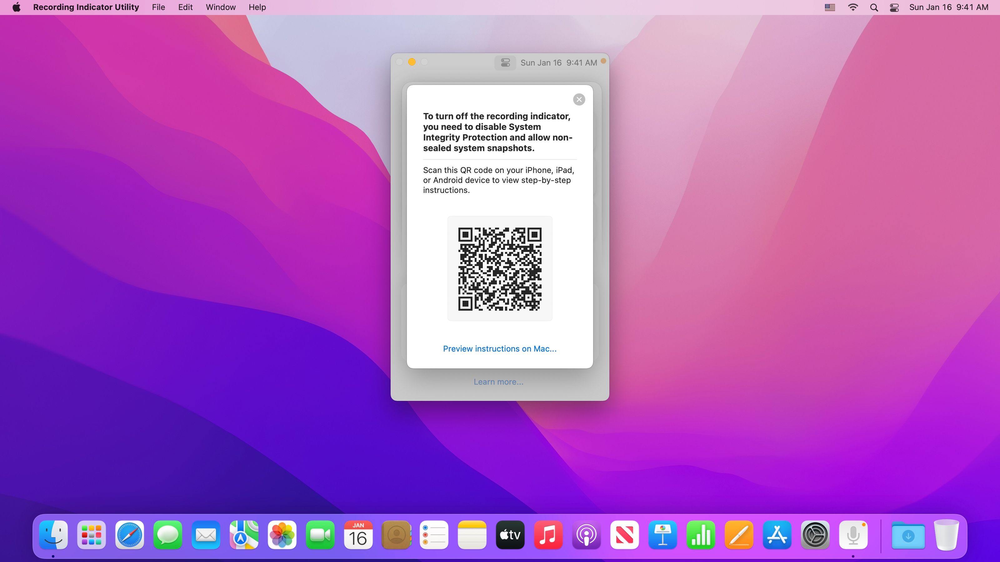

  

## Recording Indicator Utility

Recording Indicator Utility lets you customize the microphone recording indicator light, ideal for professionals who run live events, record screencasts, or use a system-wide volume equalizer.

  

  

---

### Opening Recording Indicator Utility

After downloading Recording Indicator Utility, double click to open it. macOS may prompt you “Recording Indicator Utility cannot be opened because it is from an unidentified developer.” This is expected. To open Recording Indicator Utility, [right-click](https://support.apple.com/HT207700) on Recording Indicator Utility in Finder, and click “Open” as shown below.

If you right-clicked when opening Recording Indicator Utility for the first time, you may need to [right-click](https://support.apple.com/HT207700) for a second time. If Recording Indicator Utility still can’t be opened, [check your GateKeeper settings](https://support.apple.com/en-us/HT202491) under the General tab in System Preferences > Security & Privacy. Click “Open Anyway” to open Recording Indicator Utility.

Recording Indicator Utility will not harm your Mac. This alert shows up because Recording Indicator Utility modifies macOS and cannot be notarized. Recording Indicator Utility is open source, so you can always examine its source code to verify its inner working.

---

### How Recording Indicator Utility affects security

#### Why do I need to turn off System Integrity Protection and allow booting from non-sealed system snapshots?
To configure the recording indicator on macOS Monterey 12.2 and later, Recording Indicator Utility needs to modify two system components, WindowServer and Control Center. Both components are protected by System Integrity Protection and covered by the seal of the signed system volume. Therefore you need to turn off System Integrity Protection and allow booting from non-sealed system snapshots before Recording Indicator Utility can modify them.

#### Is it easier for my Mac to be attacked when I turn off System Integrity Protection and allow booting from non-sealed system snapshots?
Because very few Mac users turn off System Integrity Protection or allow booting from non-sealed system snapshots, there's little incentive or payoff for attackers to target these configurations.

#### Why do I need to turn off FileVault?
If FileVault is on, macOS doesn't permit booting from non-sealed system snapshots, therefore you need to turn off FileVault first.

#### How do I raise security settings back to their defaults?
Open Recording Indicator Utility, turn on the recording indicator, then click "Raise Security Settings". Recording Indicator Utility will restore the last sealed system volume snapshot and show you step-by-step instructions to raise security settings.

#### Can someone use Recording Indicator Utility to monitor me without my knowledge?
No. Your admin password is required before Recording Indicator Utility can make any changes. Recording Indicator Utility is designed to support professionals who run live events, record screencasts, or use a system-wide volume equalizer.

### Why does Recording Indicator Utility ask to access the microphone?
The microphone recording indicator only updates when you pause an existing audio recording or start a new audio recording. For changes to the recording indicator to immediately take effect, Recording Indicator Utility requests access to the microphone to makes a zero (0) second long audio recording. The temporary recording is only used to refresh the microphone recording indicator, and will be automatically discarded by macOS.

#### What happens if I update macOS?
After updating macOS, changes the microphone recording indicator will be automatically reset. You can open Recording Indicator Utility and turn it back off.

---

### Troubleshooting common issues with Recording Indicator Utility

#### What if my Mac no longer starts up?
Your Mac will no longer start up if you press Option-Command-P-R to reset NVRAM or manually raise security settings in macOS Recovery without turning on the recording indicator and clicking "Raise Security Settings" in Recording Indicator Utility first. To resolve this, start up from macOS Recovery, then turn off System Integrity Protection and allow booting from non-sealed system snapshots. 

- [Instruction for Intel-based Mac](https://cormiertyshawn895.github.io/instruction/?arch=intel-lowering)
- [Instruction for Mac computers with Apple Silicon](https://cormiertyshawn895.github.io/instruction/?arch=as-lowering)

#### Why has Apple Pay been disabled?
Apple Pay is disabled when security settings are modified. You can still authorize Apple Pay payments on the web with your iPhone. To use Apple Pay on your Mac, open Recording Indicator Utility, turn on the recording indicator, then click "Raise Security Settings" and proceed with the instructions.

#### Why am I not allowed to open iPhone and iPad apps downloaded from the App Store?
On Mac computers with Apple silicon, iPhone and iPad apps downloaded from the App Store cannot open with Permissive Security. All other Mac apps, including apps built with Mac Catalyst, are not affected. You can still install and open iPhone and iPad apps through [PlayCover](https://www.playcover.me/), [Sideloadly](https://sideloadly.io/), or [Rickpactor](https://appdb.to/app/standalone/1900000033). Only install free apps or apps you have already purchased. 

To open iPhone and iPad apps downloaded from the App Store, open Recording Indicator Utility, turn on the recording indicator, then click "Raise Security Settings" and proceed with the instructions.

#### Why does Netflix and Apple TV+ stream video in HD instead of 4K?
When System Integrity Protection is turned off, certain premium video providers such as Netflix and Apple TV+ limit video quality to HD. This does not affect most video streaming websites such as YouTube and Twitch, nor does it affect local video playback or editing.

#### After using Recording Indicator Utility, why does it take slightly longer to download macOS updates?
After Recording Indicator Utility modifies WindowServer and Control Center, Software Update need to download the full macOS installer instead of a smaller update. If your network connection is metered, you can open Recording Indicator Utility, turn on the recording indicator, then click "Raise Security Settings" and proceed with the instructions. This will apply the last sealed system snapshot and allows macOS to download a smaller update.

#### What if my Mac misbehaves after raising security settings?
Before raising the security setting of your Mac, Recording Indicator Utility must apply the last sealed system snapshot. This only affects the macOS system volume and does not affect your apps or data.

If your Mac misbehaves after Recording Indicator Utility applies the last sealed system snapshot, choose Apple menu > Restart or force restart your Mac. Once your Mac starts up, open Recording Indicator Utility and click "Raise Security Settings" again.

#### Can I use Recording Indicator Utility with an older version of macOS?

Recording Indicator Utility supports macOS Monterey 12.2 and later. You can use [undot](https://github.com/s4y/undot) or [YellowDot](https://lowtechguys.com/yellowdot/) on macOS Monterey 12.1 and earlier.