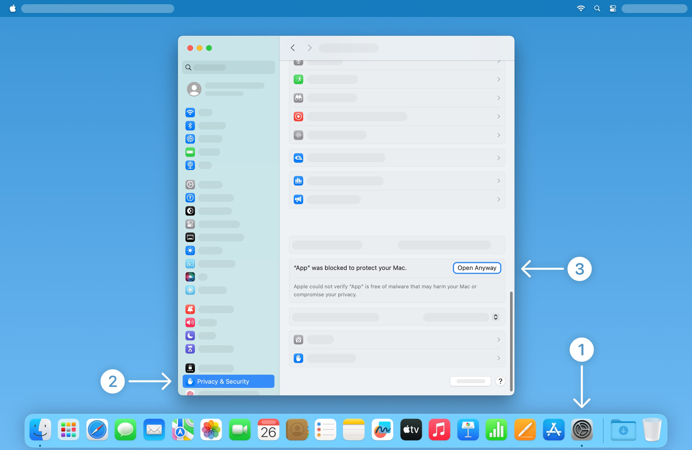

### You may not need Recording Indicator Utility

You can follow these steps to [hide the recording indicator on external displays](https://support.apple.com/118449) without using Recording Indicator Utility.

1. [Update to the latest version of macOS](https://support.apple.com/en-us/108382).
1. Start up from macOS Recovery. [Instructions for Mac with Apple silicon](https://support.apple.com/guide/mac-help/mchl82829c17/mac#mchl5abfbb29). [Instructions for Intel-based Mac](https://support.apple.com/guide/mac-help/mchl338cf9a8#mchl69906860).
1. From the Utilities menu in the menu bar, choose Terminal.
1. Enter this command: `system-override suppress-sw-camera-indication-on-external-displays=on`
1. Quit Terminal.
1. From the Apple menu, choose Restart.
1. After your Mac restarts, choose Apple menu  > System Settings, then click Privacy & Security in the sidebar.
1. Click Microphone (or Camera).
1. Turn off Privacy Indicators for Microphone (or Camera) Access.

---

### Downloading Recording Indicator Utility

You can use Recording Indicator Utility to turn off the recording indicator on the primary display and external displays not in full screen. This is ideal for professionals who <a href="https://cdm.link/2021/12/apple-added-an-orange-dot-thats-a-showstopper-for-live-visuals-and-it-needs-a-fix/">run live events</a>, <a href="https://telestreamforum.forumbee.com/t/x2hgw5f/orange-dot-on-imac-screen-when-screenflow-is-recording">record screencasts</a>, or use a <a href="https://www.globaldelight.com/faq/boom3dmac">system-wide volume equalizer</a>.

  

  

---

### Opening Recording Indicator Utility

After downloading Recording Indicator Utility, double click to open it. macOS may prompt you “Recording Indicator Utility cannot be opened because it is from an unidentified developer.” This is expected. 

To open Recording Indicator Utility, navigate to System Settings > Privacy & Security, then scroll down and click [“Open Anyway”](https://support.apple.com/102445#openanyway).

Recording Indicator Utility will not harm your Mac. This alert shows up because Recording Indicator Utility modifies macOS and cannot be notarized. Recording Indicator Utility is [open source](https://github.com/cormiertyshawn895/RecordingIndicatorUtility), so you can always [examine its source code](https://github.com/cormiertyshawn895/RecordingIndicatorUtility/tree/master/RecordingIndicatorUtility) to verify its inner working.

---

### Using Recording Indicator Utility

To use Recording Indicator Utility, you need to turn off System Integrity Protection. In macOS Sonoma 14.4 or later, you can hide the recording indicator on external displays without using Recording Indicator Utility. [Learn more ↗](https://support.apple.com/118449)

By default, the recording indicator light shows you when an app has access to your microphone. Click the blue toggle to turn off the recording indicator light across all apps.

When the “Recording Indicator” toggle is off, the recording indicator light is hidden at all times, making it ideal for professionals who [run live events](https://cdm.link/2021/12/apple-added-an-orange-dot-thats-a-showstopper-for-live-visuals-and-it-needs-a-fix/), [record screencasts](https://telestreamforum.forumbee.com/t/x2hgw5f/orange-dot-on-imac-screen-when-screenflow-is-recording), or use a [system-wide volume equalizer](https://www.globaldelight.com/faq/boom3dmac).

---

### Frequently Asked Questions

#### Can I turn off the recording indicator without downloading Recording Indicator Utility?
In macOS Sonoma 14.4 or later, you can hide the recording indicator on external displays without using Recording Indicator Utility. [Learn more ↗](https://support.apple.com/118449)

#### Why is Recording Indicator Utility asking me to scan a QR code to view instructions?
To disable System Integrity Protection, you need to start up in macOS Recovery. Because Recording Indicator Utility can’t show instructions in macOS Recovery, it is easier to follow along on another device by scanning a QR code. You can also preview the instructions on your Mac.

- [Instruction for Mac computers with Apple Silicon](https://cormiertyshawn895.github.io/instruction/?arch=riu-as-lowering)
- [Instruction for Intel-based Mac](https://cormiertyshawn895.github.io/instruction/?arch=riu-intel-lowering)

#### Is it easier for my Mac to be attacked after adjusting security settings?
Because very few Mac users turn off System Integrity Protection, there’s little incentive or payoff for attackers to target these configurations.

#### How do I raise security settings back to their defaults?
Open Recording Indicator Utility, turn on the recording indicator, then click “Raise Security Settings.” Recording Indicator Utility will restore the default security settings.

#### Can someone use Recording Indicator Utility to monitor me without my knowledge?
No. Your admin password is required before Recording Indicator Utility can make any changes. Recording Indicator Utility is designed to support professionals who [run live events](https://cdm.link/2021/12/apple-added-an-orange-dot-thats-a-showstopper-for-live-visuals-and-it-needs-a-fix/), [record screencasts](https://telestreamforum.forumbee.com/t/x2hgw5f/orange-dot-on-imac-screen-when-screenflow-is-recording), or use a [system-wide volume equalizer](https://www.globaldelight.com/faq/boom3dmac).

#### How does Recording Indicator Utility differ from undot and YellowDot?
Recording Indicator Utility supports the latest version of macOS, but requires adjusting security settings.

[undot](https://github.com/s4y/undot) and [YellowDot](https://lowtechguys.com/yellowdot/) only support macOS 12.1 and earlier, allow you to turn off the recording indicator in full-screen apps, and do not require adjusting security settings. 

#### Can I use Recording Indicator Utility with multiple copies of macOS?
Yes. Changes you made in Recording Indicator Utility only affect the current Startup Disk. After restarting to a different Startup Disk, you can run Recording Indicator Utility again to apply changes to that Startup Disk.

---

### Troubleshooting Tips

#### Why has Apple Pay been disabled?
Apple Pay is disabled when security settings are modified. You can still authorize Apple Pay payments on the web with your iPhone. To use Apple Pay on your Mac, open Recording Indicator Utility, turn on the recording indicator, then click “Raise Security Settings” and proceed with the instructions.

#### Why am I not allowed to open iPhone and iPad apps downloaded from the App Store?
On Mac computers with Apple silicon, iPhone and iPad apps downloaded from the App Store cannot open with Permissive Security. All other Mac apps, including apps built with Mac Catalyst, are not affected. You can still install and open iPhone and iPad apps through [PlayCover](https://playcover.io/), [Sideloadly](https://sideloadly.io/), or [Rickpactor](https://appdb.to/app/standalone/1900000033). Only install free apps or apps you have already purchased. 

To open iPhone and iPad apps downloaded from the App Store, open Recording Indicator Utility, turn on the recording indicator, then click “Raise Security Settings” and proceed with the instructions.

#### Why does Netflix and Apple TV+ stream video in HD instead of 4K?
When System Integrity Protection is turned off, certain premium video providers such as [Netflix](https://www.netflix.com) and [Apple TV+](http://tv.apple.com) limit video quality to HD. This does not affect most video streaming websites such as [YouTube](https://youtube.com) and [Twitch](https://www.twitch.tv), nor does it affect [local video playback](https://support.apple.com/guide/quicktime-player/welcome/mac) or [editing](https://www.apple.com/final-cut-pro/).
